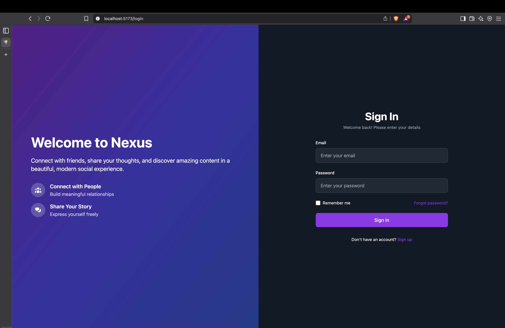
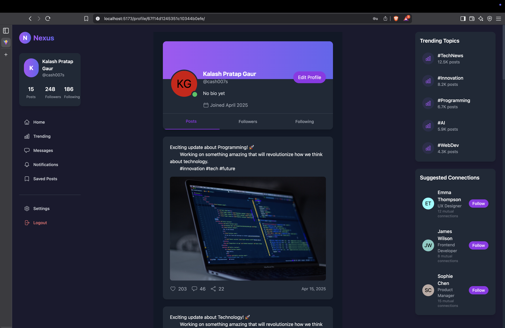
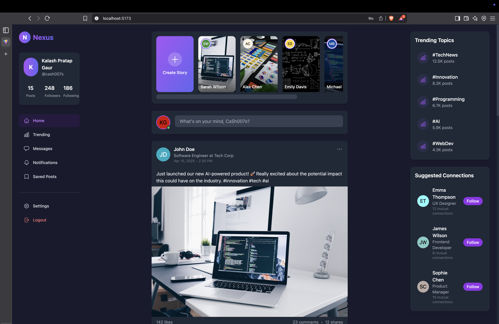

---

# 🌐 Nexus

A full-featured social media platform built with the **MERN** stack — where users can post, interact, and connect in real-time. Nexus focuses on performance, design, and an intuitive user experience.



---

## 🚀 Features

- 🔐 Authentication and JWT login  
- 💬 Commenting system  
- ❤️ Likes & Interactions  
- 📈 Trending Posts and Profiles  
- 🌙 Dark mode ready  
- 📱 Responsive design  

---

## 🛠️ Tech Stack

- **Frontend**: React.js, Tailwind CSS  
- **Backend**: Node.js, Express.js  
- **Database**: MongoDB + Mongoose  
- **Auth**: JWT, bcrypt  
- **Dev Tools**: VS Code, Git, GitHub  

---

## 🏗️ Project Structure

<pre>
nexus/
├── backend/
│   ├── config/
│   ├── controllers/
│   ├── models/
│   ├── routes/
│   ├── middleware/
│   ├── .env
│   └── server.js
│
├── frontend/
│   ├── public/
│   ├── src/
│   │   ├── assets/
│   │   ├── components/
│   │   ├── pages/
│   │   ├── services/
│   │   ├── App.jsx
│   │   └── main.jsx
│
├── screenshots/
├── .gitignore
└── README.md
</pre>

---

## 🧪 Installation

```bash
# Clone the repository
git clone https://github.com/CaSh007s/nexus.git
cd nexus

# Install backend dependencies
cd backend
npm install

# Create a .env file
touch .env
```

Add the following to `.env`:

```env
PORT=8000
MONGODB_URI=your_mongodb_connection_string
JWT_SECRET=your_secret_key
```

```bash
# Run the backend
npm run dev

# Open a new terminal and run frontend
cd ../frontend
npm install
npm run dev
```

---

## 🧪 Usage

1. Register or log in with your account.  
2. Create posts, like/comment, and edit your profile.  
3. Browse trending content and discover new profiles.  

---

## 🔌 API Endpoints

> Located in `/backend/routes/`

- `POST /api/auth/register`  
- `POST /api/auth/login`  
- `GET /api/posts`  
- `POST /api/posts`  
- `PUT /api/posts/:id`  
- `DELETE /api/posts/:id`  

---

## 📸 Screenshots

> Add your screenshots to the `/screenshots` folder. Update the markdown here with your actual images.

### 🏠 Home Page  


### 👤 Profile Page  


### 🧾 Post Feed  


---

## 📄 License

MIT License  
See the [LICENSE](./LICENSE) file for more details.

---

## 👤 Author

**Kalash Pratap Gaur**

- GitHub: [@CaSh007s](https://github.com/CaSh007s)  
- LinkedIn: [linkedin.com/in/cash007s](https://www.linkedin.com/in/cash007s/)  
- Email: [kalashpgaur76@gmail.com](mailto:kalashpgaur76@gmail.com)  

---

## 🌟 Show Your Support

If you like this project, give it a ⭐️  
Found a bug or have a feature request? Open an issue or submit a PR!
```

---
